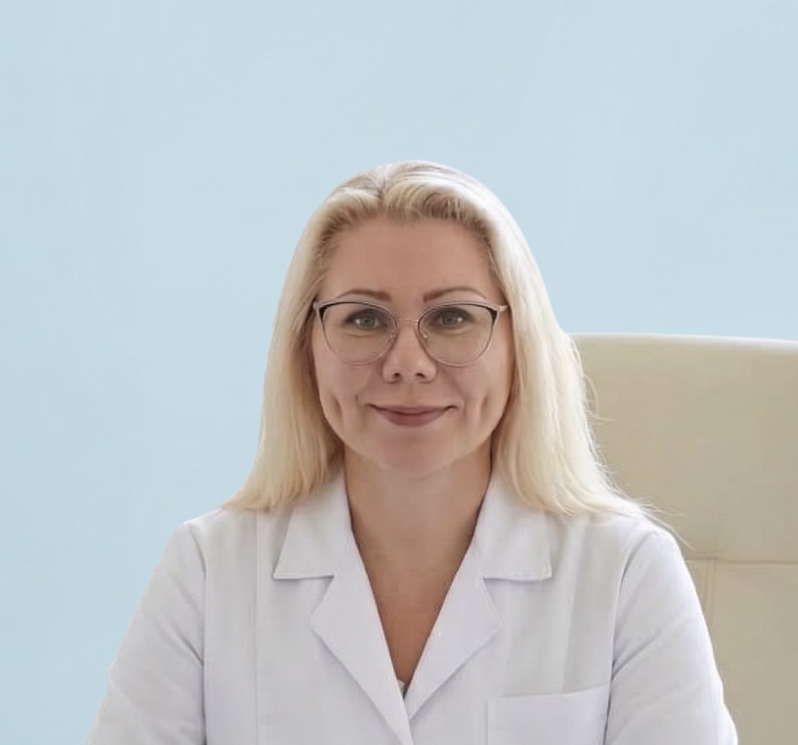
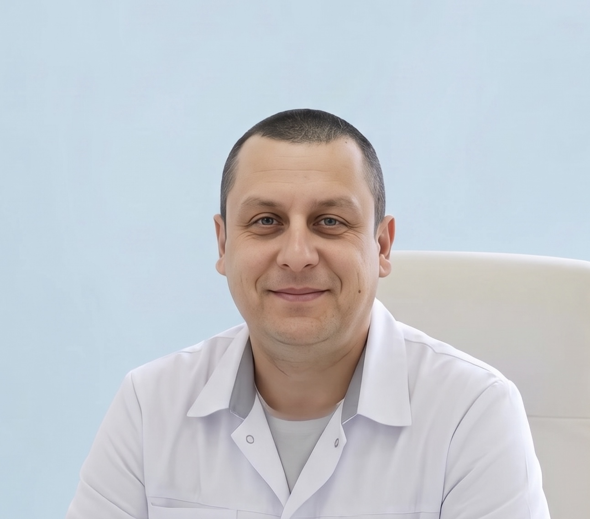

# Специалисты, оказывающие услуги

- **Терентьева Ирина Владимировна** — врач-стоматолог-терапевт, диплом
  БВС 0288958 №5513 от 01.07.1999 г. выдан Чувашским государственным
  медицинским университетом им. И. Н. Ульянова. Сведения о прохождении аккредитации специалиста УНРЗ 7724 032527154 от 24.12.2024 г. до 24.12.2029 г. ФБГОУ ДПО РАМАНПО.
  
- **Кузнецов Игорь Валерьевич** — врач-стоматолог-терапевт, диплом ДВС 1791403 от 01.07.2002 г. выдан Чувашским государственным университетом им. И. Н. Ульянова. Сведения о прохождении аккредитации специалиста УНРЗ 7724 031735192 от 27.02.2024 г. до 27.02.2029 г. ФГБОУ ДПО РМАНПО.
  
